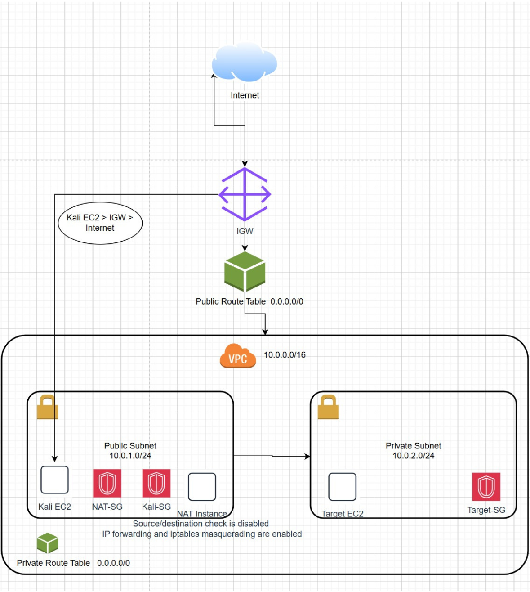

# Secure AWS VPC Architecture with Kali Linux & NAT Instance

This repository contains the architecture diagram and supporting files for my cloud security project.  
The project demonstrates how to design and deploy a secure AWS VPC using public and private subnets, a NAT instance, and a Kali Linux EC2 for controlled testing.  
It highlights cloud security fundamentals, network segmentation, Linux hardening, and secure outbound routing using free-tier resources.

---

## 📄 Full Project Write-Up (PDF)
The complete case study, including screenshots, snippets, validation, threat model, monitoring plan, and cost-control strategy, is available here:

[Download the full case study](Cloud-Security-VPC-Case-Study.pdf)

---

## 🏗️ Architecture Diagram
Add your diagram file to the repo (e.g., `architecture.png`) and reference it here:

---

## 🔐 Key Components
- VPC (10.0.0.0/16)
- Public Subnet (10.0.1.0/24)
- Private Subnet (10.0.2.0/24)
- Internet Gateway (IGW)
- Public Route Table → IGW
- Private Route Table → NAT Instance
- Kali Linux EC2 (Public Subnet)
- NAT Instance (Public Subnet)
- Target EC2 (Private Subnet)
- Security Groups (Kali-SG, NAT-SG, Target-SG)

---

## 🛡️ Security Highlights
- Network segmentation between public and private subnets  
- NAT instance routing with IP forwarding and iptables masquerading  
- Least-privilege security groups  
- No public IPs in the private subnet  
- Controlled testing environment using Kali Linux  
- Validation of outbound connectivity from private subnet  

---

## 🧠 Threat Model (High-Level)
- Public subnet exposure  
- NAT instance compromise  
- Lateral movement attempts  
- Misconfigured route tables  
- Data exfiltration risks  

---

## 📊 Monitoring & Detection
- VPC Flow Logs → CloudWatch  
- CloudTrail for API auditing  
- GuardDuty for threat detection  
- CloudWatch alarms for unusual outbound traffic  

---

## 💸 Cost-Control Strategy
- Free-tier EC2 instances  
- NAT instance instead of NAT Gateway  
- Instances stopped when not in use  
- Minimal CloudWatch retention  
- No attack traffic to avoid egress charges  

---

## 🧰 Skills Demonstrated
- AWS VPC design and subnet segmentation  
- Linux networking and NAT configuration  
- Security group design and least-privilege enforcement  
- Cloud routing and traffic flow validation  
- Threat modeling and monitoring strategy  
- Technical documentation and diagramming  
- Cloud security fundamentals  
